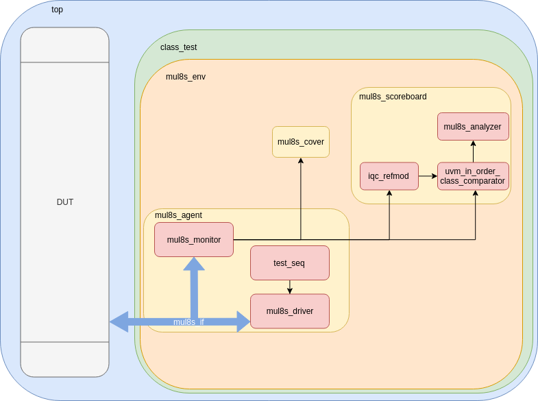

# Aproximated UVM

This repository contains a proposal UVM testbench for aproximated circuits.

This repository uses DUTs found at EvoApprox8b - Approximate Adders and Multipliers Library (https://ehw.fit.vutbr.cz/evoapproxlib/)

V. Mrazek, R. Hrbacek, Z. Vasicek and L. Sekanina, EvoApprox8b: Library of approximate adders and multipliers for circuit design and benchmarking of approximation methods. Design, Automation & Test in Europe Conference & Exhibition (DATE), 2017, Lausanne, 2017, pp. 258-261.

## Getting Started

This Testbench architecture can track the error metrics defined for correct functionality of the circuit. At the end of simulation the result is shown.



### Prerequisites

```
UVM 1.2

Cadence xrun(64): 18.09-s011

or

Synopsys vcs version : O-2018.09
```

## Running the tests

To run the simulation just do the make command.

```
make
```

If you want to change the simulaltor just modify the symbolic link:

```
ln -s Makefile.spns Makefile
```

## Authors

* **José Iuri Barbosa de Brito** - [JoseIuri](https://github.com/JoseIuri)

See also the list of [contributors](https://github.com/your/project/contributors) who participated in this project.

## License

This project is licensed under the MIT License - see the [LICENSE.md](LICENSE.md) file for details

## Contributing

1. Fork it (<https://github.com/JoseIuri/Aproximated-UVM/fork>)
2. Create your feature branch (`git checkout -b feature/fooBar`)
3. Commit your changes (`git commit -am 'Add some fooBar'`)
4. Push to the branch (`git push origin feature/fooBar`)
5. Create a new Pull Request

## Acknowledgments

* XMEN Lab - Federal University of Campina Grande - Brazil


