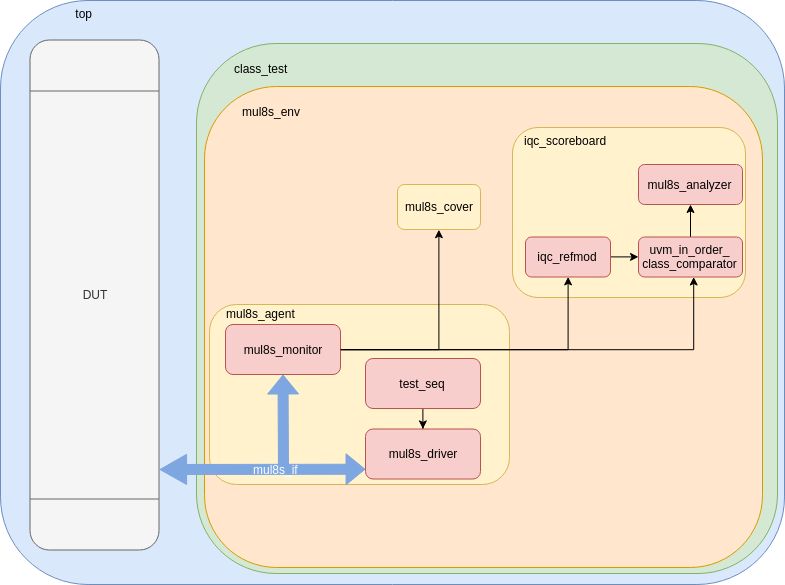

# Aproximated-UVM
This repository contains a proposal UVM testbench for aproximated circuits.

This repository uses DUTs found at EvoApprox8b - Approximate Adders and Multipliers Library (https://ehw.fit.vutbr.cz/evoapproxlib/)

V. Mrazek, R. Hrbacek, Z. Vasicek and L. Sekanina, EvoApprox8b: Library of approximate adders and multipliers for circuit design and benchmarking of approximation methods. Design, Automation & Test in Europe Conference & Exhibition (DATE), 2017, Lausanne, 2017, pp. 258-261.

